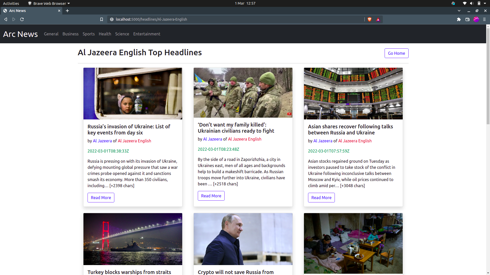

# Arc News

#### A Web Application that aggregates news from all over the world into a single platform, 1st March, 2022.

#### By **Timothy Otieno**

## Table of contents
- [Description](#description)
- [Designs](#designs)
- [Links](#links)
- [Built with](#technologies-used)
- [Bugs](#known-bugs)
- [Author](#author)
- [License](#license)

## Description
Arc News enables a user to scroll through and see available news sources, they can then click on their desired news source to view top headlines and news articles from that source.
The can also navigate to news they would like to read based on a particular category.

## Designs

## Links
- Web Application Link - <> 
- Project Repository Link - <https://github.com/otienotimothy/news-arc.git>

## Setup/Installation Requirements
* Install a Python Interpreter, if you don't already have one installed
* Install PIPENV using the command `pip install pipenv`
* Clone this repository using the url `https://github.com/otienotimothy/news-arc.git`
* Run `pipenv shell` from the created directory to create a virtual environment
* Run `pipenv install` to install all the dependencies
* Run `python run.py` to run the server locally
* From your browser, open localhost on port 5000

## Technologies Used
- Python Flask
- HTML 5
- CSS
- Bootstrap

## Support and contact details
For Support or clarifications, contact me on my email, <otienotimothyomondi@gmail.com>

## Author
**Timothy Otieno**
- Twitter - [@iamtimlord](https://twitter.com/iamtimlord)

### License
Copyright 2022 Timothy Otieno

Permission is hereby granted, free of charge, to any person obtaining a copy of this software and associated documentation files (the "Software"), to deal in the Software without restriction, including without limitation the rights to use, copy, modify, merge, publish, distribute, sublicense, and/or sell copies of the Software, and to permit persons to whom the Software is furnished to do so, subject to the following conditions:

The above copyright notice and this permission notice shall be included in all copies or substantial portions of the Software.

THE SOFTWARE IS PROVIDED "AS IS", WITHOUT WARRANTY OF ANY KIND, EXPRESS OR IMPLIED, INCLUDING BUT NOT LIMITED TO THE WARRANTIES OF MERCHANTABILITY, FITNESS FOR A PARTICULAR PURPOSE AND NONINFRINGEMENT. IN NO EVENT SHALL THE AUTHORS OR COPYRIGHT HOLDERS BE LIABLE FOR ANY CLAIM, DAMAGES OR OTHER LIABILITY, WHETHER IN AN ACTION OF CONTRACT, TORT OR OTHERWISE, ARISING FROM, OUT OF OR IN CONNECTION WITH THE SOFTWARE OR THE USE OR OTHER DEALINGS IN THE SOFTWARE.

Copyright (c) 2022 